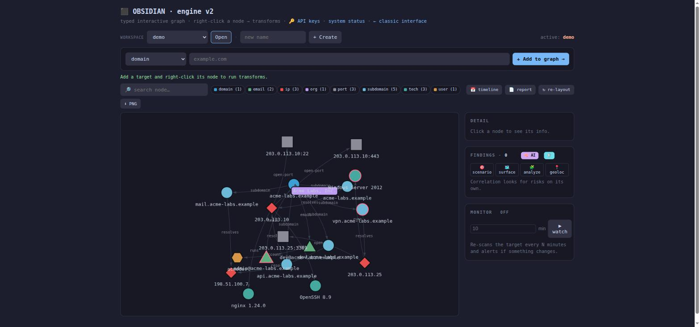
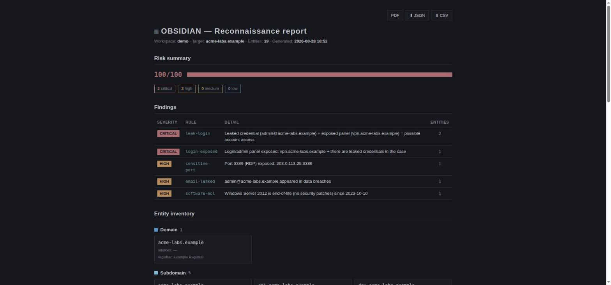

# OBSIDIAN

**An OSINT and reconnaissance framework: typed data, transforms, an interactive graph, and automatic risk correlation.**

*Security shouldn't come at an exorbitant price.*


OBSIDIAN takes two ideas that already work — Maltego's model (entities you expand
with transforms into a graph) and SpiderFoot's (typed events feeding a correlation
engine) — and puts them in one local tool with no cloud dependency. You point a
transform at a target, the graph grows on its own, an engine looks for risk, and a
background monitor pings your phone when something changes. Most of it runs without
a single API key.



---

## What it does

**Typed data model.** Every datum is a typed entity (domain, ip, email, subdomain,
username, wallet, and 17 more) with a deterministic id. The same IP found by two
different sources collapses into one node. Nothing is stored twice, and every value
carries where it came from.

**Transform engine — 95 of them.** DNS, RDAP, Certificate Transparency, subdomain
enumeration, HTTP probing, screenshots, nuclei, tech and CVE lookups, breach checks,
infostealer logs, IP reputation, favicon and TLS-cert pivots, Wayback, reverse WHOIS,
EXIF metadata, crypto tracing, Gravatar and RDAP enrichment, end-of-life detection,
and more. Writing a new one is a decorator and a function.

**Interactive graph** (`/v2`). Right-click a node to run transforms on it. Per-type
colors, filters, multi-entity pivoting, an evidence chain that shows how each datum
was reached, a timeline, and PNG export.

**Risk correlation — 18 rules.** The engine reads the whole graph and flags patterns
no single transform sees on its own: a sensitive port exposed to the internet, an
expired TLS certificate, a malicious IP, a leaked email next to an exposed login
panel, software past its end-of-life. Findings are scored and sorted. An optional
local AI acts as a second pass that explains *why* something is dangerous and catches
false positives.

**Multi-engine search.** Shodan, Censys, ZoomEye, FOFA, Quake, Hunter, Netlas,
Criminal IP, and BinaryEdge behind one query that gets translated into each engine's
dialect. The Chinese engines see infrastructure Shodan doesn't.

**Everything else.** Continuous asset monitoring with ntfy push alerts, an OPSEC layer
(Tor routing, proxy rotation, UA hygiene, per-case network identity, IP-leak checks),
a sock-puppet vault, workspaces backed by SQLite with snapshots, a self-contained HTML
report, JSON/CSV/PDF export, and a scriptable CLI that does all of the above.



---

## Install

Requires Python 3.14. Clone it, install the dependencies, and run:

```bash
git clone https://github.com/nadiee567-lgtm/obsidian.git
cd obsidian
python -m venv .venv && . .venv/bin/activate
pip install -r requirements.txt

OBSIDIAN_PASSWORD=your_password python obsidian_web.py
# open http://localhost:8767/v2
```

The server binds to localhost only. On first run it prints a generated password if
you didn't set `OBSIDIAN_PASSWORD`.

A few transforms lean on system tools when they're present (`dig`, `nmap`, `whois`,
`exiftool`, `nuclei`, `tor`, and `playwright` for screenshots). None are required —
the engine skips a transform quietly if its tool isn't installed.

### Docker

```bash
OBSIDIAN_PASSWORD=your_password docker compose up
```

### CLI

```bash
python obsidian_cli.py transforms domain            # transforms for a type
python obsidian_cli.py run domain github.com dns_a  # a single transform
python obsidian_cli.py recon domain github.com -w case1   # all applicable, in parallel
python obsidian_cli.py report -w case1 -o report.html
python obsidian_cli.py export json -w case1 -o case.json
```

---

## API keys (optional) and free alternatives

OBSIDIAN is **keyless-first**. With no API key at all you already get most of the
value — DNS, RDAP, Certificate Transparency, subdomains, HTTP probing, nuclei,
breach checks, IP reputation, favicon and cert pivots, Wayback, Gravatar, RDAP, and
more need nothing. Only a handful of transforms ask for a key, and those are marked
with a key symbol in the interface so you always know which is which.

Keys are **bring-your-own** and free to obtain. You paste your own key into the
encrypted vault (Fernet, `0600` file) from the API keys panel, and it never leaves
your machine. There is no OBSIDIAN account and no shared key.

| Needs a key | What it does | Free keyless alternative already included |
|---|---|---|
| Shodan / Censys / ZoomEye / FOFA / Quake / Hunter / Netlas / Criminal IP / BinaryEdge | Internet search engines (ports, services, infra) | `ports` (nmap), `geo_ip`, `ip_reputation`, `ip_blocklist`, `greynoise`, `ripe_netinfo`, `ip_rdap` |
| HIBP | Email in data breaches | `breaches_xon` (XposedOrNot), `comb` (ProxyNova), `stealer_hudsonrock` |
| VirusTotal | Passive DNS history of a domain | `crtsh`, `subdomains_ht`, `rdap` |
| ViewDNS | Other domains of the same registrant | — |

Most of the paid engines have a **free tier** (Censys, FOFA, Netlas). Shodan's paid
membership is a one-time payment, not a subscription, and it's included free with the
[GitHub Student Pack](https://education.github.com/pack) if you're a student. You do
not need to buy anything to use OBSIDIAN to the fullest.

---

## Writing a transform

A transform takes one input entity and emits zero or more outputs. The decorator
registers it; `ctx.emit` creates the entity, deduplicates it, links it to the input,
and records where it came from.

```python
from core.transforms import transform

@transform(input='domain', outputs=('ip',), description='A records (dig)')
def dns_a(entity, ctx):
    for ip in resolve_A(entity.value):
        ctx.emit('ip', ip, label='resolves')
```

If a transform crashes mid-run, the engine isolates the failure and returns whatever
it managed to emit — one broken source never takes down a case. External plugins load
from a directory without touching the core.

---

## Architecture

```
obsidian_web.py     Flask server + the transforms (endpoints under /api/v2/*)
obsidian_cli.py     the same engine from the terminal
web/                v2.html (graph UI), app.html / login.html (classic UI)
core/
  modelo.py         Entity, Relation, Store (dedup, events)
  transforms.py     @transform, Context.emit, the runner, machines, cache
  correlacion.py    @rule, correlate, risk_score
  reporte.py        self-contained HTML report
  persistencia.py   SQLite persistence with automatic schema migration
  monitor.py        snapshot + diff + background Monitor
  workspaces.py     case manager (SQLite, snapshots, history)
  boveda.py         encrypted API-key vault (Fernet)
  motores.py        multi-engine query translator
  ia.py             single door to the local AI (Ollama)
  validacion.py     per-type allowlist, anti-SSRF, anti-path-traversal
```

The `core/` package knows nothing about Flask. It's pure, testable logic; the web UI
and the CLI are two fronts over the same engine.

---

## Security

The design assumes the target's data is hostile.

- Per-type **allowlist** validation, and tools run via `argv` with no shell — so
  neither command nor argument injection is possible.
- **Anti-SSRF:** private, loopback, and link-local addresses are rejected, and every
  redirect is revalidated (including cloud-metadata IPs).
- Case names are checked against **path traversal**.
- The graph and the report **escape** all target data (stored-XSS protection).
- The CSV export **neutralizes formula injection** (`= + - @`).
- API keys live in an **encrypted vault**, never in plaintext and never in the repo.

---

## Tests

```bash
pip install -r requirements-dev.txt
python -m pytest -q       # 279 tests
```

They cover the data model, the transforms (with real breach and scanner payloads
mocked), the security validators, correlation, workspaces, the vault, the report,
export, the monitor, notifications, OPSEC, the AI layer, the multilingual sources,
and the CLI.

---

## License

OBSIDIAN is released under the **PolyForm Noncommercial License 1.0.0** (see
[`LICENSE`](LICENSE)). You may use, study, modify, and share it for any noncommercial
purpose — personal use, research, education, hobby projects. **Commercial use requires
a separate license from the author.** If you want to use OBSIDIAN commercially, get in
touch.

---

This is a personal project, built to learn and to show what one person can put together
in the open. Issues and questions are welcome.
